 

---

<h3 align="center">Connect With Me</h3>

 

---

<h3 align="center">Tech Stack &amp; Tools</h3>

 

---

<h3 align="center">Contribution Activity</h3>

<picture>
<source media="(prefers-color-scheme: dark)" srcset="https://raw.githubusercontent.com/iamnotnenex/iamnotnenex/output/pacman-contribution-graph-dark.svg" />
<source media="(prefers-color-scheme: light)" srcset="https://raw.githubusercontent.com/iamnotnenex/iamnotnenex/output/pacman-contribution-graph.svg" />

</picture>

♡ Thanks for stopping by. ♡

