---

<h3 align="center">Connect With Me</h3>

---

<h3 align="center">Languages &amp; Code</h3>

Languages used in my public repositories.

---

<h3 align="center">Contribution Activity</h3>

<picture>
<source media="(prefers-color-scheme: dark)" srcset="https://raw.githubusercontent.com/iamnotnenex/iamnotnenex/output/pacman-contribution-graph-dark.svg" />
<source media="(prefers-color-scheme: light)" srcset="https://raw.githubusercontent.com/iamnotnenex/iamnotnenex/output/pacman-contribution-graph.svg" />

</picture>

Thanks for stopping by.

